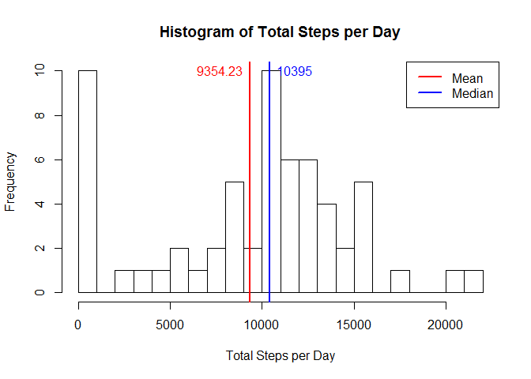
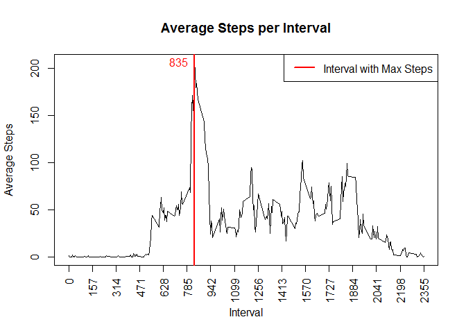
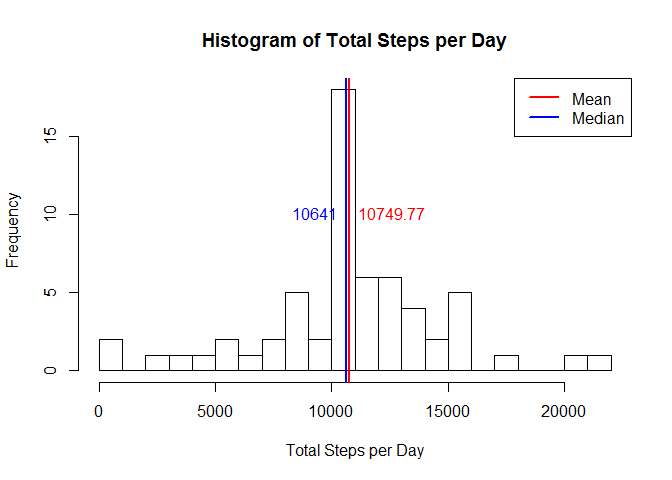
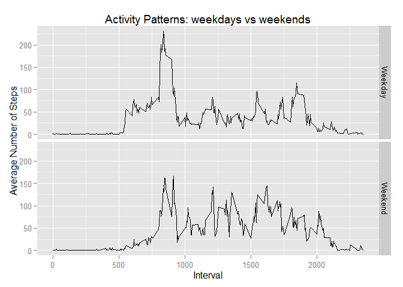

# Reproducible Research: Peer Assessment 1
BSWolfset  
January 08, 2016  

Dataset: Activity monitoring data [52K]
The variables included in this dataset are:
     
- steps: Number of steps taking in a 5-minute interval (missing values are coded as NA)
- date: The date on which the measurement was taken in YYYY-MM-DD format
- interval: Identifier for the 5-minute interval in which measurement was taken
The dataset is stored in a comma-separated-value (CSV) file and there are a total of 17,568 observations in this dataset.

## Loading and preprocessing the data
Load and Preprocess Data to translated dates to date()

```r
library(sqldf)
```

```
## Warning: package 'sqldf' was built under R version 3.2.3
```

```
## Loading required package: gsubfn
```

```
## Loading required package: proto
```

```
## Loading required package: RSQLite
```

```
## Loading required package: DBI
```

```r
library(dplyr)
```

```
## 
## Attaching package: 'dplyr'
```

```
## The following objects are masked from 'package:stats':
## 
##     filter, lag
```

```
## The following objects are masked from 'package:base':
## 
##     intersect, setdiff, setequal, union
```

```r
library(lubridate)
library(ggplot2)
options(scipen=999)
setwd("~/Class/Reproducible Research/Assignment1")
activitydf <- read.csv("activity.csv")
```

## What is mean total number of steps taken per day?
1. Calculate the total number of steps taken per day ignoring the missing values in the dataset
2. Make a histogram (not barplot) of the total number of steps taken each day
3. Calculate and report the mean and median of the total number of steps taken per day


```r
## Aggregate data and calculate mean and median
TotSteps <- aggregate(activitydf$steps, by=list(activitydf$date), FUN="sum", na.rm=TRUE)
Stpmedian <- round(median(TotSteps$x, na.rm = TRUE), digits=2)
Stpmean <- round(mean(TotSteps$x, na.rm = TRUE), digits=2)
## Plot
hist(as.numeric(TotSteps$x), main="Histogram of Total Steps per Day", xlab="Total Steps per Day", breaks=22)
abline(v = Stpmean,lwd=2, col="red")
text(x=Stpmean, y=10, Stpmean, pos=2, col="red")

abline(v = Stpmedian,lwd=2, col="blue")
text(x=Stpmedian, y=10, Stpmedian, pos=4, col="blue")
legend("topright", lwd=2, bty="y", col=c("red", "blue"), legend=c("Mean", "Median"))
```

\

The mean steps per day is 9354.23 and the median steps per day is 10395.

## What is the average daily activity pattern?
1. Make a time series plot (i.e. type = "l") of the 5-minute interval (x-axis) and the average number of steps taken, averaged across all days (y-axis)
2. Which 5-minute interval, on average across all the days in the dataset, contains the maximum number of steps?

```r
## Aggregate steps and calculate interval with maximum average steps
TSMeanSteps <- sqldf("select interval as interval, avg(steps) as MnStps
                        from activitydf
                       where steps is not null
                       group by interval")
```

```
## Loading required package: tcltk
```

```r
mxStps <- max(TSMeanSteps$MnStps)
mxdf <- subset(TSMeanSteps, MnStps==mxStps)
mxInt <- mxdf$interval
## Plot
with(TSMeanSteps, plot(interval, MnStps, type='l', xaxp=c(0,2355,15), las=3,
                       xlab="Interval", ylab="Average Steps", main="Average Steps per Interval"))
abline(v=mxInt, col="red", lwd=2)
text(x=mxInt, y=mxStps, mxInt, pos=2, col="red")
legend("topright", lwd=2, bty="y", col=c("red"), legend=c("Interval with Max Steps"))
```

\

On average, the 835 5-minute interval contains the most steps each day.

## Inputing missing values
There are a number of days/intervals where there are missing values (coded as NA). The presence of missing days may introduce bias into some calculations or summaries of the data.
1. Calculate and report the total number of missing values in the dataset (i.e. the total number of rows with NAs)
2. Fill in all of the missing values in the dataset by using the mean for that 5-minute interval when the value is missing.
3. Create a new dataset that is equal to the original dataset but with the missing data filled in.


```r
## Calculate number of missing values
MissVl <- sqldf("select count(*) from activitydf where steps is null")
## Create new dataset.  Where steps are null, substiture with average from the interval
ActivityNNdf <- sqldf("select MnStps as steps, date, activitydf.interval as interval
                         from activitydf, TSMeanSteps
                        where activitydf.steps is null
                          and activitydf.interval = TSmeanSteps.interval
                       union
                       select steps, date, activitydf.interval
                         from activitydf, TSMeanSteps
                        where activitydf.steps is not null")
```

4. Make a histogram of the total number of steps taken each day and Calculate and report the mean and median total number of steps taken per day.
- Do these values differ from the estimates from the first part of the assignment?
- What is the impact of inputing missing data on the estimates of the total daily number of steps?


```r
## Aggregate steps and calculate mean and median
TotSteps2 <- aggregate(ActivityNNdf$steps, by=list(ActivityNNdf$date), FUN="sum", na.rm=TRUE)
Stpmedian2 <- round(median(TotSteps2$x, na.rm = TRUE), digits=2)
Stpmean2 <- round(mean(TotSteps2$x, na.rm = TRUE), digits=2)
## Plot
hist(as.numeric(TotSteps2$x), main="Histogram of Total Steps per Day", xlab="Total Steps per Day", breaks=22)
abline(v = Stpmean2,lwd=2, col="red")
text(x=Stpmean2, y=10, Stpmean2, pos=4, col="red")
abline(v = Stpmedian2,lwd=2, col="blue")
text(x=Stpmedian2, y=10, Stpmedian2, pos=2, col="blue")
legend("topright", lwd=2, bty="y", col=c("red", "blue"), legend=c("Mean", "Median"))
```

\


- There are 2304 missing values in the data set.  These are intervals with no steps reported.
- The missing values were substituted with the average of the intervals.
- For the dataset where the values were replaced, the mean steps per day is 10749.77 and the median steps per day is 10641.
- With the missing data, the mean steps per day was 9354.23 and the median steps per day is 10395.
- The difference in the means is 1395.54 and in the medians is 246.
- This shows that giving the missing data a value, increased the total mean and median.

## Are there differences in activity patterns between weekdays and weekends?
1. Enhance the previous dataset (with no missing values) with a new factor variable with two levels - "weekday" and "weekend" indicating whether a given date is a weekday or weekend day.


```r
## subset weekday data and add column for Weekday
ActivityWDdf <- subset(ActivityNNdf, weekdays(as.Date(as.character(ActivityNNdf$date), "%Y-%m-%d"),abbreviate = TRUE) %in% c('Mon','Tue','Wed', 'Thu', 'Fri'))
ActivityWDdf <- mutate(ActivityWDdf, DayTyp="Weekday")
## subset weekend data and add column for weekend
ActivityWEdf <- subset(ActivityNNdf, weekdays(as.Date(as.character(ActivityNNdf$date), "%Y-%m-%d"),abbreviate = TRUE) %in% c('Sat','Sun'))
ActivityWEdf <- mutate(ActivityWEdf, DayTyp="Weekend")
## Join the datasets and turn the Day type into a factor
ActivityWk <- bind_rows(ActivityWDdf, ActivityWEdf)
ActivityWk <- transform(ActivityWk, DayTyp=factor(DayTyp))
```

2. Make a panel plot containing a time series plot of the 5-minute interval (x-axis) and the average number of steps taken, averaged across all weekday days or weekend days (y-axis).


```r
## Average the steps
TSMeanWkSteps <- sqldf("select interval as interval, DayTyp, avg(steps) as MnStps
                        from ActivityWk
                       where steps is not null
                       group by interval, DayTyp")
## Plot
qplot(interval, MnStps, data=TSMeanWkSteps, facets=DayTyp~., geom="path",
      xlab = "Interval", ylab = "Average Number of Steps",
      main="Activity Patterns: weekdays vs weekends") 
```

\
